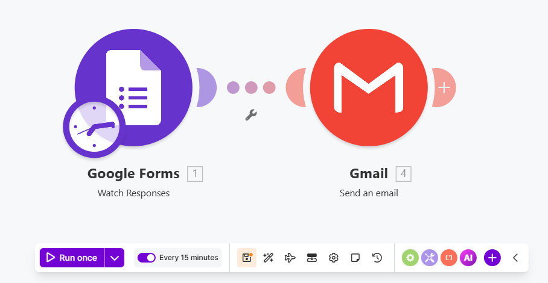

# Taller de automatización con Make + Google Forms + Gmail

Este taller tiene como objetivo crear una automatización básica sin programar, en la que una respuesta enviada desde Google Forms activa el envío automático de un correo de confirmación mediante Gmail usando Make.

---

## 🔁 Flujo del ejercicio

Google Form enviado → Make detecta la respuesta → Gmail envía correo automático de confirmación

---

## 🛠️ Herramientas a utilizar

Para desarrollar este ejercicio se utilizarán las siguientes herramientas:

- **Make**: plataforma de automatización no-code.
- **Google Forms**: herramienta para crear formularios.
- **Gmail**: servicio de correo para enviar la confirmación automática.
- **Cuenta de Google**: necesaria para conectar Google Forms y Gmail con Make.

---

## 📘 Guía paso a paso

Para realizar el taller completo, sigue la guía detallada en el siguiente documento:

👉 📥 **Descargar o visualizar el paso a paso completo aquí:**

[📄 Paso_a_paso.pdf](Paso_a_paso.pdf)

---

## 📌 Entrega del taller

Subir un **documento en PDF** que evidencie la implementación completa del flujo de automatización realizado en Make.

El documento debe contener los siguientes elementos:

---

## 🖼️ 1. Evidencia de implementación

El estudiante debe modificar el escenario original agregando personalización dinámica en el correo automático.

### Requisitos obligatorios

### ✅ Personalizar el asunto del correo

El asunto debe incluir el nombre ingresado en el formulario.

Ejemplo:

```text
Hola Juan, hemos recibido tu formulario
```

Para lograrlo, el asunto debe utilizar el campo dinámico correspondiente al nombre capturado desde Google Forms.

---

### ✅ Agregar nuevas variables al formulario

Además de los campos básicos, el formulario debe incluir **mínimo 3 nuevos campos**.

Ejemplos sugeridos:

- Ciudad
- Número telefónico
- Tipo de solicitud

---

### ✅ Personalizar el cuerpo del correo

El cuerpo del correo debe incluir al menos **3 variables dinámicas nuevas** provenientes del formulario.

Ejemplo:

```text
Hola Juan,

Hemos recibido correctamente tu información.

Resumen del registro:

- Ciudad: Bogotá
- Teléfono: 3001234567
- Tipo de solicitud: Información académica

Gracias por completar el formulario.

Saludos,
Equipo de soporte
```

---

## 📷 Capturas de pantalla 

El PDF debe incluir capturas claras de:

### 1. Formulario actualizado
Mostrar los nuevos campos agregados.

### 2. Configuración del módulo Gmail
Mostrar:
- asunto dinámico
- variables utilizadas
- configuración del Body

### 3. Escenario completo en Make
Mostrar todos los módulos conectados.

### 4. Correo recibido
Mostrar el resultado final con:
- asunto personalizado
- variables visibles dentro del mensaje

---

## ✍️ 2. Reflexión

Responder las siguientes preguntas de manera clara y argumentada.

### Pregunta 1

**¿Qué ventajas ofrece utilizar variables dinámicas dentro de una automatización frente a enviar mensajes genéricos?**

---

### Pregunta 2

**¿Cómo podría aplicarse este tipo de automatización en un contexto académico, empresarial o personal?**

---

📌 **Importante:**

- El documento debe subirse en formato PDF.
- Las capturas deben ser legibles.
- El correo recibido debe mostrar personalización real usando datos del formulario.

## 🚀 Recomendación

Sigue el paso a paso cuidadosamente y verifica cada conexión antes de ejecutar el escenario en Make.
